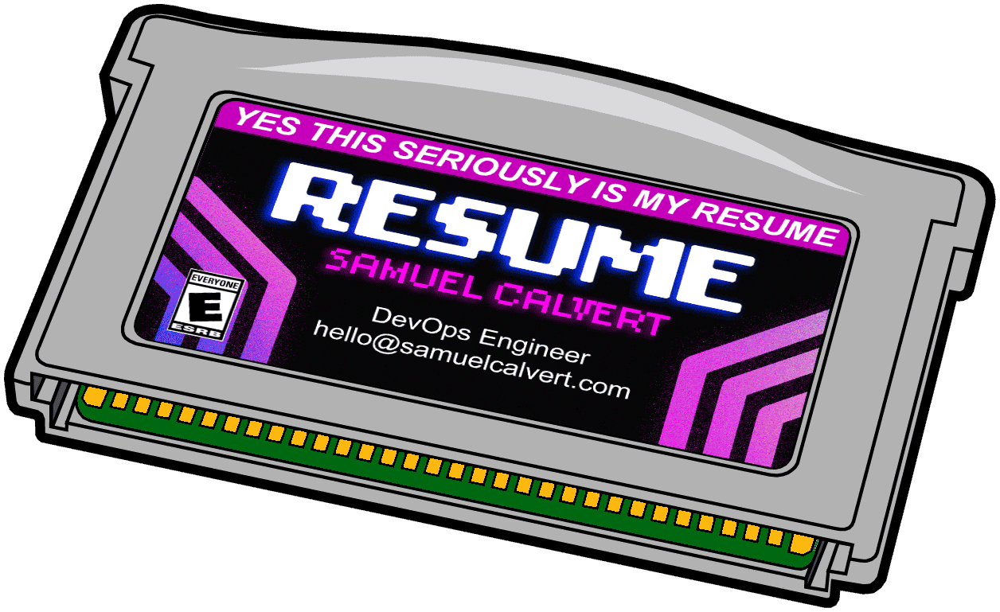

> ### Play it on the web @ [gba.samuel.computer](https://gba.samuel.computer)

Looking for a new job in NYC this summer has been a challenge.

On one end LinkedIn and other job sites have pushed the cost of advertising openings to nearly zero. On the other, AI and “Easy Apply” have made it simple to tailor your application to as many jobs as possible and push out slop. The consequences of these competing forces are heavy-handed application filters and automated black box rejections.

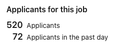

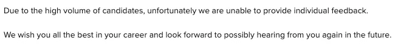

A more human approach is needed.

One of the advantages of living in NYC is the ease of moving from the online to the real world. Weekly meetups offer deeper connection and instant feedback from similar professionals. (S/o [rust meetup NYC](https://www.meetup.com/rust-nyc/))

Still, I wanted to stand out while offering a tactile memento. And so, out of childhood love and fun, the Game Boy Advance Resume…

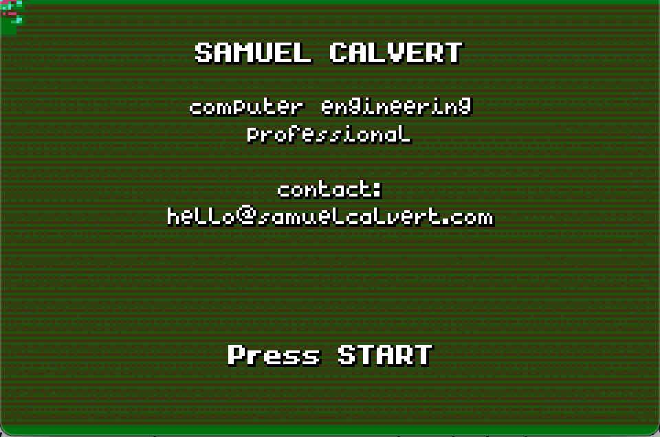

This was always meant to be a smallscale, quick project. I'm not interested in pursuing game development or understanding the inner workings of a 20 y/o game console. [Butano](https://github.com/GValiente/butano) was perfect for this, it offers a high level C++ library with many examples to draw from. This let me brush up on my C++ in a way that was much more fun than grinding leetcode.

During my preliminary research I came across a creator who put [Tenet](https://www.youtube.com/watch?v=S4od1AdB8e4) on 5 GBA cartridges using the project [avi2gba](https://github.com/kran27/Meteo-AVI-to-GBA). Unfortunately, this project appears to have been abandoned over a decade ago. However, I really wanted to incorporate a small video into the startup of my game.

I reached out on the [gbadev](https://gbadev.net) discord to see if anyone had done something similar.

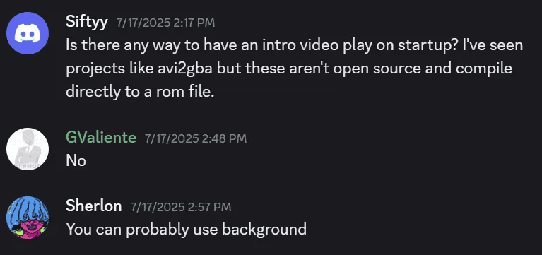

And in the most chopped way imaginable, you can in fact change a background frame every second to accomplish exactly this.

```cpp
namespace video
    {
        constexpr const bn::regular_bg_item* frames[] = {
            &bn::regular_bg_items::frame_0000,
            &bn::regular_bg_items::frame_0001,
            &bn::regular_bg_items::frame_0002,
            &bn::regular_bg_items::frame_0003,
            &bn::regular_bg_items::frame_0004,
            &bn::regular_bg_items::frame_0005,
            &bn::regular_bg_items::frame_0006,
            &bn::regular_bg_items::frame_0007,
            &bn::regular_bg_items::frame_0008,
            &bn::regular_bg_items::frame_0009,
            &bn::regular_bg_items::frame_0010,
            &bn::regular_bg_items::frame_0011,
            &bn::regular_bg_items::frame_0012,
            &bn::regular_bg_items::frame_0013,
            &bn::regular_bg_items::frame_0014,
            &bn::regular_bg_items::frame_0015,
            &bn::regular_bg_items::frame_0016,
            &bn::regular_bg_items::frame_0017,
            &bn::regular_bg_items::frame_0018,
            &bn::regular_bg_items::frame_0019,
            &bn::regular_bg_items::frame_0020,
            ....
        };

        constexpr int frame_count = sizeof(frames) / sizeof(frames[0]);
    }
```

Butano is a bit finicky with importing assets and needs precisely uncompressed .bmp images with either 16 or 256 colors. Below I have put the python script used to downsample the 29.97 FPS 1080p video to 15 FPS 240x160 needed for the GBA.

## Frame Extraction Pipeline

**Frame Selection**: Maps target framerate to source framerate. For 15 FPS output from a 29.97 FPS source, we extract roughly every 4th frame by calculating `frame_number = int(time_seconds * video_fps)`.

**Processing Pipeline**:

- BGR→RGB conversion (OpenCV to PIL convention)
- 10% contrast boost to improve quantization results
- LANCZOS downsampling to 240×160 (GBA resolution)
- Center in 256×256 canvas
- Ordered dithering to 16-color palette

**Output**: Each frame generates:

- 4-bit BMP (16 colors)
- JSON metadata enabling Butano's tile deduplication


```python
# Open video with OpenCV
    cap = cv2.VideoCapture(INPUT_VIDEO)
    
    # Get video properties for frame extraction calculations
    video_fps = cap.get(cv2.CAP_PROP_FPS)
    total_frames = int(cap.get(cv2.CAP_PROP_FRAME_COUNT))
    video_duration = total_frames / video_fps
    
    print(f"Video FPS: {video_fps}")
    print(f"Total frames in video: {total_frames}")
    print(f"Video duration: {video_duration:.2f} seconds")
    print(f"Extracting {FRAMES_TO_EXTRACT} frames at {FPS} FPS")
    
    # Get the fixed palette for all frames
    palette = get_fixed_palette()
    
    # Calculate which frame numbers to extract
    frame_times = []
    for i in range(FRAMES_TO_EXTRACT):
        time_seconds = i / FPS  # When this frame should appear
        frame_number = int(time_seconds * video_fps)
        frame_times.append(frame_number)
    
    print(f"\nStarting frame extraction...")
    
    frame_count = 0      # Current position in video
    extracted_count = 0  # Number of frames we've saved
    
    # Process video frame by frame
    while extracted_count < FRAMES_TO_EXTRACT and cap.isOpened():
        ret, frame = cap.read()
        if not ret:
            break
        
        # Check if this is a frame we want to extract
        if extracted_count < len(frame_times) and frame_count == frame_times[extracted_count]:
            # OpenCV uses BGR, PIL uses RGB
            frame_rgb = cv2.cvtColor(frame, cv2.COLOR_BGR2RGB)
            
            # Convert to PIL Image for processing
            pil_image = Image.fromarray(frame_rgb)
            
            # Apply slight contrast enhancement
            # This helps the color quantization produce better results
            enhancer = ImageEnhance.Contrast(pil_image)
            pil_image = enhancer.enhance(1.1)  # 10% contrast boost
            
            # Resize to GBA screen size
            # LANCZOS is high-quality downsampling filter
            pil_image = pil_image.resize((GBA_WIDTH, GBA_HEIGHT), Image.LANCZOS)
            
            # Create background image with 256x256 dimensions
            bg_image = Image.new('RGB', (BG_WIDTH, BG_HEIGHT), (0, 0, 0))
            
            # Calculate position to center the frame
            x_offset = (BG_WIDTH - GBA_WIDTH) // 2
            y_offset = (BG_HEIGHT - GBA_HEIGHT) // 2  
            
            # Paste the resized frame in the center
            bg_image.paste(pil_image, (x_offset, y_offset))
            
            # Quantize to 16 colors using ordered dithering
            indexed_image = quantize_to_palette_ordered(bg_image, palette)
            
            # Save as BMP file
            # Butano expects 4-bit BMP files
            frame_filename = f"frame_{extracted_count:04d}.bmp"
            bmp_path = os.path.join(OUTPUT_DIR, frame_filename)
            indexed_image.save(bmp_path, format='BMP', bits=4)
            
            # Create JSON metadata for Butano
            json_filename = f"frame_{extracted_count:04d}.json"
            json_path = os.path.join(OUTPUT_DIR, json_filename)
            
            metadata = {
                "type": "regular_bg",                    # Regular background (not affine)
                "bpp_mode": "bpp_4_manual",             # 4 bits per pixel (16 colors)
                "colors_count": 16,                      # Explicitly specify color count
                "repeated_tiles_reduction": True,        # Optimize repeated 8x8 tiles
                "flipped_tiles_reduction": False,       # Don't check for flipped tiles
                "palette_reduction": False               # Use our fixed palette
            }
            
            with open(json_path, 'w') as f:
                json.dump(metadata, f, indent=4)
            
            print(f"Processed frame {extracted_count + 1}/{FRAMES_TO_EXTRACT}")
            extracted_count += 1
        
        frame_count += 1
    
    # Clean up
    cap.release()
```

*Claude did a great job vibing out the right color palette for my image.*

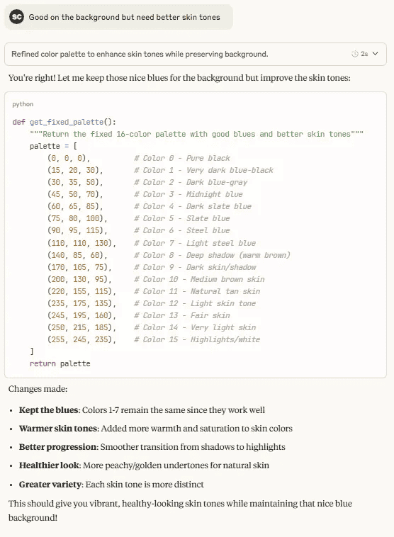

After showing off the basic prototype to the group at [sideprojectsaturday.com](http://sideprojectsaturday.com), the main criticism was that it needed more than just a physical implementation if I was going to get my project in front of as many eyeballs as possible. As the name suggests, [GBAjs2](https://github.com/andychase/gbajs2) is a Game Boy Advance emulator written entirely in JS. While not perfectly compatible with all games and some issues with Firefox, Andy’s implementation worked perfectly with my ROM. Only minor changes were needed to autoload my ROM on startup. Thanks Andy!

## Hardware

The real ‘wow factor’ of this project is being able to play the game on genuine hardware. To accomplish this goal I needed:

- Some cheap Gameboy Advances
- Rewriteable cartridges
- Custom labels
- Packaging

The most expensive part of this project was going to be acquiring the Game Boys. With most eBay listings hovering between $60 - $100 this was a non-starter since I was risking them never being returned. I did see references to knockoff Game Boys that played actual cartridges ~5 years ago, but it appears that production has stopped and they no longer fetch a reasonable price.

Game Boy Advances aren’t region locked, what if I went directly to the source? Searching Japanese auction sites, I was able to find hundreds of listings for aging GBAs in workable condition. Even better, many of them were being sold in lots. Using [buyee.jp](http://buyee.jp), I was able to bid on these auctions and secure 10x GBAs for $30 each after import fees.

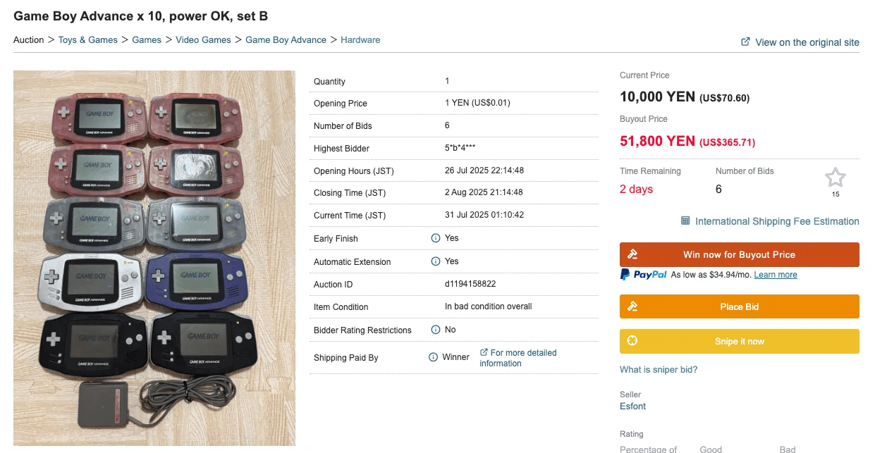

With the consoles secured and ROM file in hand, I now needed cartridges and a way to write them.

The [GBxCart RW](https://www.gbxcart.com/) was the perfect option for writing ROMs with support for a broad range of after market carts and a database available of known carts [flashcartdb.com](https://www.flashcartdb.com/).

Even with these resources I found it difficult to determine what cartridge I would be getting from the Aliexpress vendors. Eventually I decided to roll the dice on some clone Mother 3 carts.

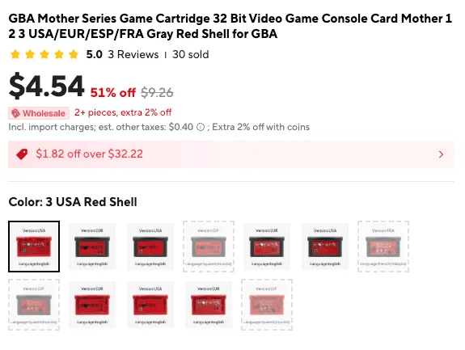

This ended up working out! I asked my friend [Jess](https://www.jessundart.com/) to design some custom labels then added NFC tags inside each shell that link directly to the online emulator. I've found that people love the experience of "plugging in" the game to the back of their phones. This retro feel with modern devices is certainly my favorite part.

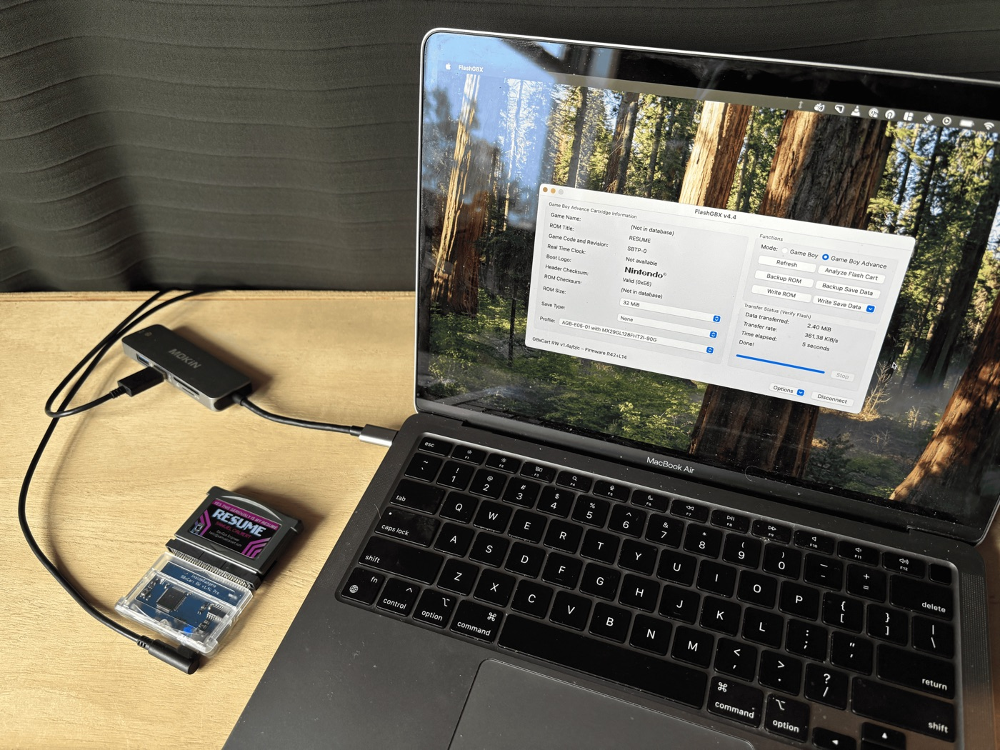

A 3D printed insert to hold and display both items finished off the project. My biggest disappointment has been the low contrast of these original Game Boy Advance screens.

I looked into replacing these original screens with updated IPS panels, but couldn’t justify the cost. As an alternative, I’ve included a LED worm light, another childhood staple.

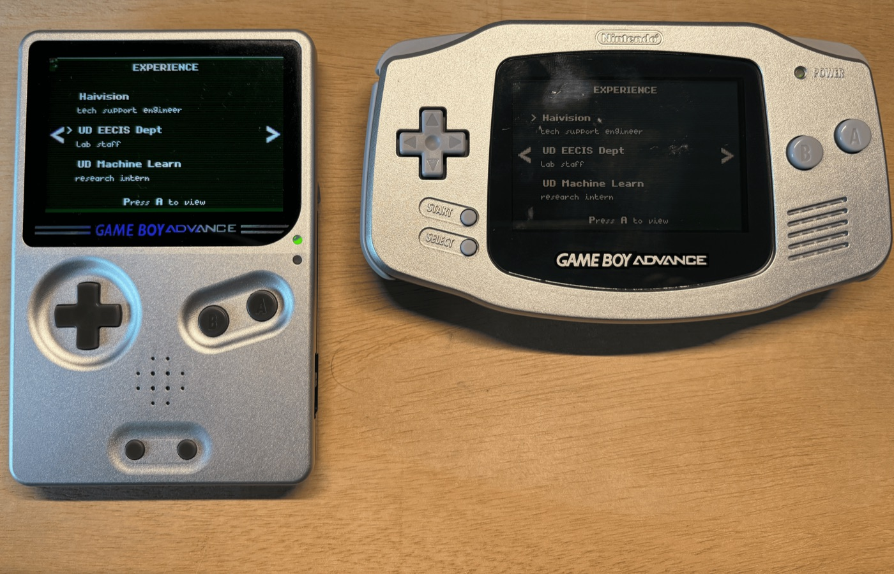

I’ve shipped off 5 of these packages to prospective companies with the hope of getting a foot in the door. Regardless of the outcome, I’ve had fun putting this project together and am proud of what I’ve made.

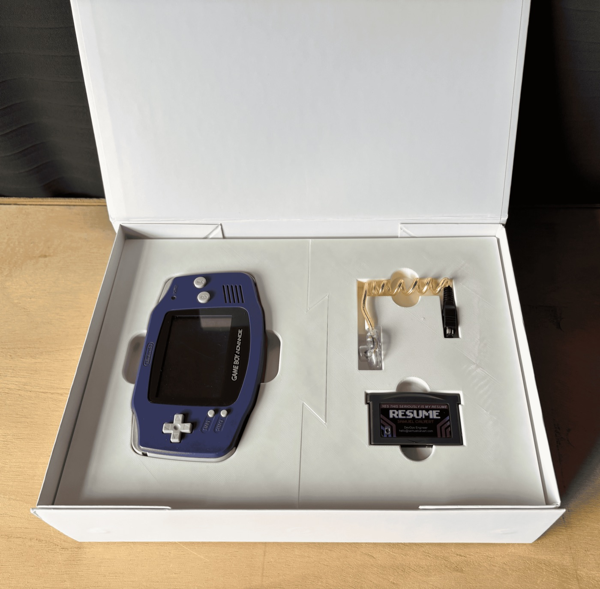

I’m continuing to look for my next opportunity and creative outlet. If this project stirs something in you, please reach out. I’m always looking to connect with other makers.
