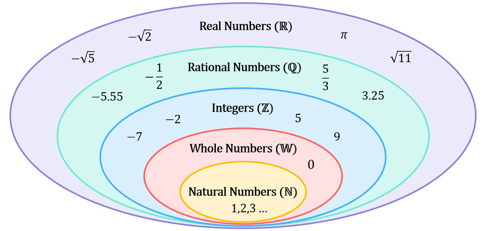
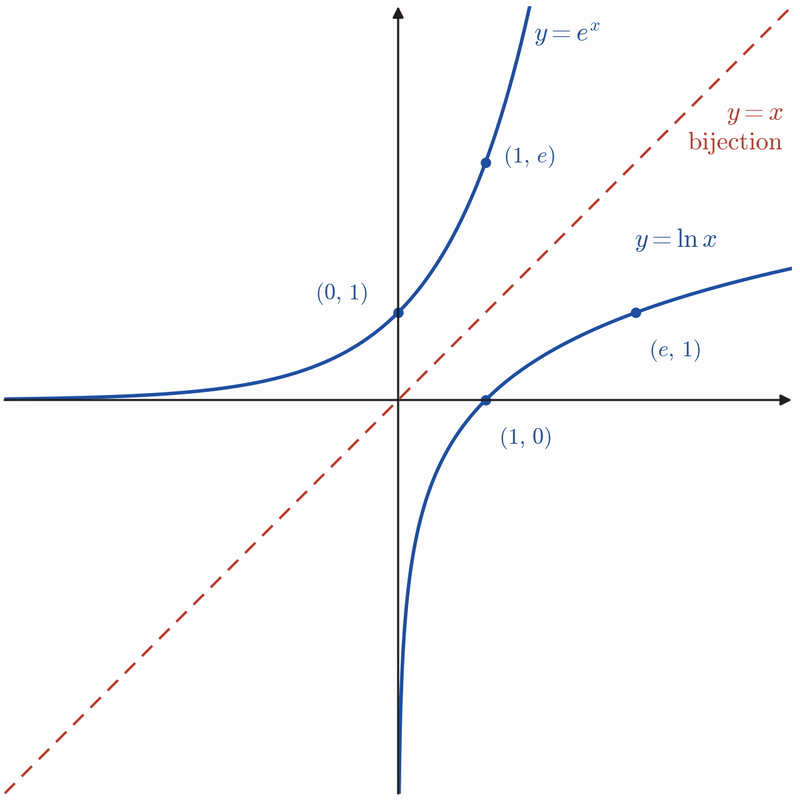

One of, if not *the* hardest thing about math is the same operation can be viewed from many different lenses. This is math's super power, but can make mathematical objects appear fuzzy at the edges, and hard to pin down.

I'd like to slowly build up your intuition for exponentials, showing how, at its core, the fundamental property of exponentials and logarithms are that they are mappings from addition to multiplication, and from multiplication back to addition.

In mathematical lingo, we'd say that exponentials are a group isomorphism from the additive group of the reals onto the multiplicative group of positive reals. Or more terse:

$$
\exp : (\mathbb{R}, +) \;\xrightarrow{\;\sim\;}\; (\mathbb{R}_{>0}, \times), \qquad b^x = e^{x \ln b}
$$

It's okay if neither explanation makes sense yet. With each successive step into larger sets starting with the Naturals and moving up to the Reals we'll see that what once may have seemed like an arbitrary choice of algebraic manipulation is ultimately reinforcing a rich underlying structure.

## Natural Numbers $\mathbb{N}$

| Type of exponent  | Example exponential | Equivalent logarithm | Reasoning                        |
| ----------------- | ------------------- | -------------------- | -------------------------------- |
| Positive integers | $2^3 = 8$           | $\log_2(8) = 3$      | Definition of raising to a power |

When first introduced in grade school, "raising to a power", or repeated multiplication is a powerful tool to create and manipulate increasingly large numbers. Lest we forget the awe of learning about a googol ($10^{100}$) or even a googolplex ($10^{{10}^{100}}$).

$$
2^{3+2} = \overbrace{2 \cdot 2 \cdot 2}^{3} \cdot \overbrace{2 \cdot 2}^{2} = 2^3 \cdot 2^2
$$

Since multiplication _associates_, we can show that a number $b$ raised to the power of a sum of exponents ($b^{x+y}$) is equivalent to the product of two exponentials with that same base ($b^x b^y$).

$$
b^{x+y} = b^x b^y
$$

This is our first glimpse of the mapping from addition to multiplication, and it's the defining characteristic of exponentiation. From here on out, every extension to larger sets of numbers is to preserve this quality.

## Whole Numbers $\mathbb{W}$

| Type of exponent | Example exponential | Equivalent logarithm | Reasoning                                    |
| ---------------- | ------------------- | -------------------- | -------------------------------------------- |
| Zero             | $2^0 = 1$           | $\log_2(1) = 0$      | Preserves property $2^{a+b} = 2^a \cdot 2^b$ |

$b^0=1$ is the only solution which preserves our fundamental property.

$$
2^{3+0}= \overbrace{2 \cdot 2 \cdot 2}^{3} \cdot \overbrace{1}^{0} = 2^3 \cdot 2^0
$$

$0$ is the additive identity and $1$ is the multiplicative identity.

$$
0 + x = x, \qquad 1 \cdot x = x.
$$

## Integers $\mathbb{Z}$

| Type of exponent  | Example exponential                      | Equivalent logarithm                   | Reasoning                                       |
| ----------------- | ---------------------------------------- | -------------------------------------- | ----------------------------------------------- |
| Negative integers | $2^{-2} = \dfrac{1}{2^2} = \dfrac{1}{4}$ | $\log_2\left(\dfrac{1}{4}\right) = -2$ | Preserves property $2^{a-b} = \dfrac{2^a}{2^b}$ |

The extension to the integers may seem intuitive at this point. With our fundamental property $b^{x+y} = b^x b^y$, the "opposite" of addition is subtraction and the "opposite" of multiplication is division, so of course when preserving this property $2^{a-b} = \dfrac{2^a}{2^b}$ . Let's take a slight detour to formalize what "opposite" means here.

#### Numbers as Functions

If instead of treating a number $b$ as an abstract value floating in space, we might imagine it as a function $f_b$ acting on the number line, sliding every point left or right by $b$.

$$
f_b : a \mapsto a + b
$$

A number as a function? Acting on the whole number line? There's a big mental shift going on here. Thinking about numbers as actions performed on the spaces they live in doesn't feel comparable to thinking about them as objects in a set. But that's the intuition we're building here. Being able to move freely between these pictures will unlock new connections between once unrelated topics.

Multiplication follows a similar thought process. Which function $g_b$ stretches the number line by a factor of $b$?

$$
g_b : a \mapsto b\cdot a
$$

Doing one after another is function composition, and it's equivalent to performing each action in sequence.

$$
f_a \circ f_b = f_{a+b}, \qquad g_a \circ g_b = g_{ab}
$$

Now watch what the exponential does to a slide. Pick a point $a$ and slide it by $b$, then exponentiate:

$$
a \;\xrightarrow{f_b}\; a+b \;\xrightarrow{\exp_2}\; 2^{a+b}
$$

Our fundamental property lets us draw the equivalence: $2^{\,a+b} = 2^b \cdot 2^a$. But $2^b \cdot 2^a$ is just $2^a$ *stretched by a factor of $2^b$*. So we could equally have exponentiated first and stretched afterwards:

$$
a \;\xrightarrow{\exp_2}\; 2^a \;\xrightarrow{g_{2^b}}\; 2^b\cdot 2^a
$$

Both routes end at the same point, for every $a$. In symbols,

$$
\exp_2 \circ f_b \;=\; g_{2^b} \circ \exp_2
$$

This is our fundamental property in a new light: **the exponential turns slides into stretches.** A slide by $b$ on the input side becomes a stretch by $2^b$ on the output side.

This is our same identity as before, but recontextualized from our new idea as numbers as functions!

$$
f_0 \circ f_x = f_x, \qquad g_1 \circ g_x = g_x
$$

The inverse asks: which function undoes $f_b$, taking us back to $\mathrm{id}$?

$$
f_b \circ f_b^{-1} = \mathrm{id} \;\Rightarrow\; f_b^{-1} = f_{-b}, \qquad g_b \circ g_b^{-1} = \mathrm{id} \;\Rightarrow\; g_b^{-1} = g_{1/b}.
$$

These are our "opposite" arithmetic operations, subtraction and division are just the inverses of sliding and stretching. And the exponential respects them. Undoing a slide by $b$ maps to undoing a stretch by $2^b$:

$$
\exp_2 : f_{-b} \mapsto g_{2^{-b}} = g_{1/2^b} = (g_{2^b})^{-1},
$$

which is exactly the rule $2^{\,a-b} = \dfrac{2^a}{2^b}$.

## Rationals $\mathbb{Q}$

| Type of exponent | Example exponential  | Equivalent logarithm             | Reasoning                             |
| ---------------- | -------------------- | -------------------------------- | ------------------------------------- |
| Fractional       | $2^{1/2} = \sqrt{2}$ | $\log_2 \sqrt{2} = \dfrac{1}{2}$ | Preserves property $(2^a)^b = 2^{ab}$ |

Once again, let's return to our motivating example, this time asking a slightly different question. Our fundamental property turns one addition into one multiplication. What happens if we apply it three times, $b^{x_1 + x_2 + x_3} = b^{x_1}\, b^{x_2}\, b^{x_3}$? Does the mapping from addition to multiplication still hold, and can it be extended to an arbitrary number of applications?

$$
2^{2 + 2 + 2}= \overbrace{2^2 \cdot 2^2 \cdot 2^2}^{3} = (2^2)^3
$$

We see that yes! It does still hold. And we've gained a new rule in the process. Adding the same exponent to itself $n$ times is multiplication by $n$, so

$$
b^{\overbrace{x + x + \cdots + x}^{n}} = \overbrace{b^x \, b^x \cdots b^x}^{n} \quad\Longrightarrow\quad (b^x)^n = b^{nx}
$$

Nothing new was assumed: this is $b^{x+y} = b^x b^y$ applied $n$ times in a row. Read right to left, it says an exponent that's a multiple of $n$ can be pulled apart into $n$ identical factors. What if we run that backwards? Instead of starting with $n$ factors and merging them, start with a number and _ask_ for its $n$ identical factors. Take the simplest exponent we have, $1$, and split it into $n$ equal pieces:

$$
2^{1} = 2^{\overbrace{\frac1n + \frac1n + \cdots + \frac1n}^{n}} = \overbrace{2^{1/n} \cdot 2^{1/n} \cdots 2^{1/n}}^{n} = \bigl(2^{1/n}\bigr)^n
\;\;\Rightarrow\;\; 2^{1/n} = \sqrt[n]{2}
$$

Let's make sure this works for less trivial cases as well. We can demonstrate this by showing that the equivalent fractions $\tfrac24$ and $\tfrac12$ will give the same answer.

$$
2^{m/n} = (2^{1/n})^m \;\;\Rightarrow\;\;2^{2/4} = \bigl(2^{1/4}\bigr)^2 = \sqrt2
$$

To our delight, the fundamental property still holds.

> [!note]- A more functional view
> Repetition is composition. Sliding by $x$ three times is one slide by $3x$; stretching by $c$ three times is one stretch by $c^3$. We express a function repeatedly composed with itself using the notation $f_x^{\,\circ n}$ where $n$ is the number of times $f_x$ is being composed.
>
> $$
> f_x^{\,\circ 3} = f_x \circ f_x \circ f_x = f_{3x}, \qquad g_c^{\,\circ 3} = g_c \circ g_c \circ g_c = g_{c^3}.
> $$
>
> Take $2^{2+2} = 2^2 \cdot 2^2 = 2^4$ and watch it happen on both number lines.
>
> **Upstairs, on the exponent line**, the exponent $4$ is built from two slides by $2$. Each blue arrow is one $f_{2}$; laid end to end they cover the same distance as the single orange $f_{4}$. That's $2 + 2 = 4$, drawn:
>
> $$
> f_{2} \circ f_{2} = f_{2}^{\,\circ 2} = f_{4}.
> $$
>
> 
>
> **Downstairs, on the value line**, the exponential has translated each slide by $2$ into a stretch by $2^2 = 4$. Two of those stretches take the point from $1$ to $4$ to $16$ — the same place a single stretch by $2^4 = 16$ sends it. That's $4 \cdot 4 = 16$, drawn:
>
> $$
> g_{4} \circ g_{4} = g_{4}^{\,\circ 2} = g_{16}.
> $$
>
> 
>
> Notice the shapes. Upstairs the blue arrows are equal, because adding $2$ twice is two equal steps. Downstairs the second blue arrow is four times the first, because multiplying by $4$ twice is a step that grows. The exponential turned "equal steps" into "steps that grow by the same factor" — that's what $(2^2)^2 = 2^{2\cdot2}$ *looks like*.
>
> Now run it backwards. Which slide, done twice, gives a slide by $1$? Half of it:
>
> $$
> f_{1/2} \circ f_{1/2} = f_1
> $$
>
> 
>
> The exponential turns slides into stretches, so it must send $f_{1/2}$ to a stretch that, done twice, gives a stretch by $2^1 = 2$:
>
> $$
> g_c \circ g_c = g_{c^2} = g_2 \;\;\Rightarrow\;\; c = \sqrt2
> $$
>
> 
>
> That is what $2^{1/2}$ means in this picture: half a slide upstairs becomes the square root of a stretch downstairs. The point goes $0 \to \tfrac12 \to 1$ on the exponent line and $1 \to 1.414 \to 2$ on the value line. Upstairs the two steps are equal. Downstairs the second step is $\sqrt2$ times the first, the same "grows by the same factor" shape as before.
>
> - **$n$ pieces:** $f_{1/n}^{\,\circ n} = f_1$ becomes $g_{2^{1/n}}^{\,\circ n} = g_2$.
> - **$m$ of those pieces:** $f_{m/n} = f_{1/n}^{\,\circ m}$ becomes $g_{2^{1/n}}^{\,\circ m}$, which is $2^{m/n}$ again.

## Reals $\mathbb{R}$

| Type of exponent | Example exponential         | Equivalent logarithm            | Reasoning            |
| ---------------- | --------------------------- | ------------------------------- | -------------------- |
| Irrational       | $2^{\sqrt2} \approx 2.6651$ | $\log_2(2.6651) \approx \sqrt2$ | Preserves continuity |

We've reached our final set $\mathbb{R}$, and with that, we'll see the definition of the exponential function in all its glory. We've been building up our intuition in both a value, and functional based context, seeing that in each framing, the mapping between addition and multiplication remains preserved. With the rationals, we proved that our mapping still holds, $x$ is decomposed into $n$ identical factors. But what do we do when $x$ is irrational?

Starting with our example $f(x) = 2^x$, we can decompose it into $n$ factors.

$$
2^{x} = 2^{\overbrace{\frac xn + \frac xn + \cdots + \frac xn}^{n}} = \overbrace{2^{x/n} \cdot 2^{x/n} \cdots 2^{x/n}}^{n}
$$

And using our new rule from the Rationals $(b^x)^n = b^{nx}$, we can get back to our original function.

$$
(2^{x/n})^{n} = f(x/n)^n = f(x)
$$

#### How does this help us?

Reading from inside out, we see $f(x)$ being decomposed into $n$ factors. Effectively zooming in on a very small neighborhood of $0$, next, we compose the function $n$ times, "zooming out" to see the function in its entirety.

Once we zoom in far enough our function starts to look linear! This means we can find a rational approximation of $2^{\sqrt{2}}$.  Recalling our grade school algebra course, a line is fully characterized by $y = mx+c$ . We also know that our identity maps $0 \to 1$ so we can set our $y$ intercept to $1$, defining a linear approximation for our function at values close to $0$ as $2^{x/n} \approx 1 + m(\frac{x}{n})$. Doing this calculation with 1000 factors gets us reasonably close.

$$
m = \frac{\Delta y}{\Delta x} \approx \frac{2^{0.001} - 2^{0}}{0.001 - 0} = \frac{0.0006934}{0.001} = 0.6934
$$

$$
2^{\sqrt2/1000} \approx 1 + 0.693147 \cdot \frac{1.414214}{1000} = 1.000980258
$$

$$
2^{\sqrt2} \approx (1.000980258)^{1000} \approx 2.6639
$$

The true value is $2^{\sqrt2} = 2.6651$, so our approximation gets us within $0.0013$. More factors means a closer zoom, a more accurate linear approximation, and a better answer. Let's push this idea further.

| $n$   | $\left(1 + 0.693147 \cdot \tfrac{\sqrt2}{n}\right)^n$ | error   |
| ----- | ----------------------------------------------------- | ------- |
| 1     | 1.9803                                                | 25.70%  |
| 10    | 2.5476                                                | 4.41%   |
| 100   | 2.6525                                                | 0.476%  |
| 1000  | 2.6639                                                | 0.048%  |
| 10000 | 2.6650                                                | 0.0048% |

#### What happens when we decompose into infinitely many factors?

$$
b^{\overbrace{\frac1n + \frac1n + \cdots + \frac1n}^{n \to \infty}} = \overbrace{b^{1/n} \cdot b^{1/n} \cdots b^{1/n}}^{n \to \infty}
$$

When we start asking about infinitely small steps in a function, this should set off some neurons linked to calculus. If we manipulate our slope to start looking a bit more like the definition of a derivative...

$$
\frac{\Delta y}{\Delta x} = \frac{f(x_2) - f(x_1)}{x_2 - x_1} \;\overset{x_1 = x,\; x_2 = x + h}{=}\; \frac{f(x + h) - f(x)}{h}
$$

We see that our fundamental property lets us factor out $2^x$ *entirely*.

$$
\frac{2^{x + h} - 2^x}{h} = \frac{2^{x}2^{h} - 2^x}{h} = 2^x\frac{2^{h} - 1}{h}
$$

This may seem like a subtle algebraic manipulation but it has huge implications. It's showing that our derivative $f'(x)$ is a scale multiple of the original function $f(x)$. This holds true for any exponential function $b^x$.

$$
f'(x) = f(x) \lim_{h \to 0} \frac{b^{h} - 1}{h}
$$

For our example:

$$
m = \lim_{h \to 0} \frac{2^{h} - 1}{h} \approx 0.693147
$$

The derivative of $2^x$ is itself, scaled by a factor of $0.693147$. Let's see what the scale factors of other exponential functions are.

| $b^x$           | Scale Factor |
| --------------- | ------------ |
| $.5^x$          | $-0.693147$  |
| $\frac{1}{3}^x$ | $-1.098612$  |
| $2^x$           | $0.693147$   |
| $3^x$           | $1.098612$   |
| $10^x$          | $2.302585$   |

What if we want $f'(x) = f(x)$? Which base gives a scale factor of exactly 1? Let's give the scale factor its own name and see if we can get there:

$$
L(b) = \lim_{h \to 0} \frac{b^{h} - 1}{h}
$$

The base we're after is the one where $L(b) = 1$. We can't solve this directly, but we can see what happens to $L$ when we change the base. Swap $b$ for $b^x$ and use the power rule $(b^x)^h = b^{xh}$:

$$
L(b^x) = \lim_{h \to 0} \frac{(b^{x})^{h} - 1}{h} = \lim_{h \to 0} \frac{b^{xh} - 1}{h}
$$

The exponent is $xh$ but the denominator is only $h$, so multiply by $\frac{x}{x}$ (for $x \neq 0$) to make them match:

$$
L(b^x) = \lim_{h \to 0} x \cdot \frac{b^{xh} - 1}{xh}
$$

Now let $k = xh$. As $h \to 0$, $k \to 0$ as well, so

$$
L(b^x) = x \lim_{k \to 0} \frac{b^{k} - 1}{k} = x\,L(b)
$$

Raising the base to the power $x$ multiplies its scale factor by $x$. That means we can rescale any base to get the scale factor we want. Choosing $x = 1/L(b)$:

$$
L\!\left(b^{1/L(b)}\right) = \frac{1}{L(b)} \cdot L(b) = 1
$$

Starting from $b = 2$, where $L(2) \approx 0.6931$:

$$
e = 2^{1/L(2)} \approx 2^{1.4427} \approx 2.718
$$

This is the number $e$, we've been searching for it all along. And it's the exact base where $\frac{d}{dx}e^x = e^x$.

The "scale factor" as we've been calling it is generally known by another name. $L(b^x) = x\,L(b)$ is a log law giving us the inverse. Raising $e = b^{1/L(b)}$ to the power $L(b)$ gives $b = e^{L(b)}$, so $L(b) = \log_e b$. The scale factor was a logarithm all along. This is what defines the natural logarithm.

### Final Thoughts

Our original and generally opaque definition, that "exponentials are a group isomorphism from the additive group of the reals onto the multiplicative group of positive reals", might have started to come into focus at this point.

$$
\exp : (\mathbb{R}, +) \;\xrightarrow{\;\sim\;}\; (\mathbb{R}_{>0}, \times)
$$

Breaking it down piece by piece, every part of it is something we've already built.

- **exp:** $b^x = e^{x \ln b}$, and $e^x = \lim_{n\to\infty}(1 + x/n)^n$
- **Group:** Our sets of numbers ($\mathbb{N},\mathbb{W},\mathbb{Z},\mathbb{Q},\mathbb{R}$), with the ability to slide and stretch from the Numbers as Functions section.
- **Positive reals:** $2^x = (2^{x/2})^2$ rules out negatives, and $2^x \cdot 2^{-x} = 1$ rules out zero.
- **Homomorphism:** the fundamental property, with the identity $b^0 = 1$, inverse $b^{-x} = 1/b^x$ and product rule $(b^x)^n = b^{nx}$ as forced consequences.
  - **Isomorphism:** the logarithm as the reverse map, $\log_b(xy) = \log_b x + \log_b y$.

### Towards the Future

There's still so much more to be said about exponentials. They're a rich playground for exploring the fundamental structure of mathematical objects and a launchpad into more abstract algebraic theory. I'll leave you with a commutative diagram of the exponential function if you'd like to tug at the threads of category theory.

$$
\begin{array}{ccc}
(\mathbb{R},+) & \xrightarrow{\;\;x \,\mapsto\, nx\;\;} & (\mathbb{R},+) \\[6pt]
\Big\downarrow{\scriptstyle \exp_2} & & \Big\downarrow{\scriptstyle \exp_2} \\[6pt]
(\mathbb{R}_{>0},\times) & \xrightarrow{\;\;y \,\mapsto\, y^n\;\;} & (\mathbb{R}_{>0},\times)
\end{array}
$$

#### Next Up:

We'll see how the complex exponential is a surjective group homomorphism from the additive group of $\mathbb{C}$ onto the multiplicative group of nonzero complex numbers, with kernel $2\pi i\,\mathbb{Z}$.

$$
\exp : (\mathbb{C}, +) \twoheadrightarrow (\mathbb{C}^\times, \times), \qquad \ker(\exp) = 2\pi i\,\mathbb{Z}
$$
